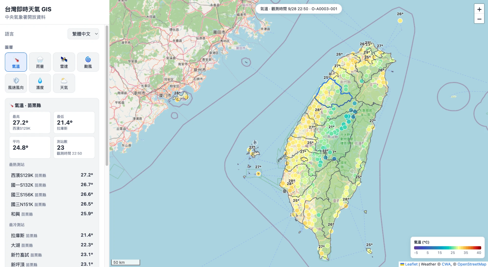

# 台灣即時天氣 GIS · Taiwan Live Weather GIS

🌐 **線上版：https://aiot-hw-1-weather-map.vercel.app**



AIoT L3 CWA HW1 — 以中央氣象署（CWA）開放資料建立的台灣即時天氣地理資訊系統。
資料流：**CWA Open Data API → SQLite → Flask API → Leaflet 互動地圖**。所有天氣數值皆來自資料庫，不使用任何模擬資料。

> A Leaflet dashboard of live Taiwan weather built on CWA Open Data. Every value on the map is read from SQLite, which an ETL fills from the real CWA API. UI available in 繁體中文 / English / 日本語 / 한국어.

## 功能

| 類別 | 內容 |
|---|---|
| 圖層 | 🌡️ 氣溫 · 🌧️ 雨量 · 🛰️ 雷達 · 🌀 颱風 · 💨 風速風向 · 💧 濕度 · ⛅ 天氣 |
| 顯示 | 📍 測站點位 · 縣市界線（GeoJSON，依縣市平均值著色） · 氣溫數字標籤 |
| 底圖 | 街道圖（OpenStreetMap）· 淺色 · 深色（Esri Canvas），深色底圖同時切換為深色介面 |
| 儀表板 | 各圖層統計（最高／最低／平均）、排行、縣市篩選、測站搜尋、雷達播放、颱風資訊卡 |
| 其他 | 📌 定位我的位置（顯示最近測站天氣）、四種介面語言、偏好設定記憶、手機版抽屜式側欄 |

## 資料集

| Dataset | 名稱 | 用途 |
|---|---|---|
| `O-A0003-001` | 現在天氣觀測報告（363 站） | 氣溫、今日最高／最低、濕度、風、天氣、氣壓、UV |
| `O-A0002-001` | 自動雨量站（約 1,300 站） | 10 分鐘～24 小時累積雨量 |
| `W-C0034-005` | 熱帶氣旋路徑 | 颱風過去路徑、預測路徑、暴風半徑、70% 機率半徑 |
| `O-A0058-003` | 雷達整合回波圖 | 去背並重新投影為 Web Mercator 的雷達疊圖 |

> `O-A0003-001` 為**觀測**資料集：MinT / MaxT 對應當日實測最低／最高溫，時間為觀測時間；此資料集不提供降雨機率（PoP）。

## 架構

```
CWA Open Data API
      │  src/cwa_api.py   真實 HTTP 請求、狀態檢查、依實際 JSON 結構解析
      ▼
   ETL             src/etl.py        擷取 → 驗證 → 載入（原始回應存於 data/raw/）
      │            src/radar.py      雷達圖去背與 Mercator 重投影
      ▼
   SQLite          src/database.py   schema、資料驗證、upsert（去重）
      │            data/weather.db
      ▼
   Flask API       app.py            /api/observations /api/rain /api/typhoons /api/radar
      ▼
   Leaflet UI      public/           index.html · static/app.js · i18n.js · style.css
                   public/static/data/taiwan_counties.geojson（Vercel 以 CDN 直接提供）
```

### 資料庫設計

- `stations` / `observations`：觀測站與觀測值，主鍵 `(station_id, obs_time)`
- `rain_stations` / `rain_observations`：雨量站與雨量，主鍵 `(station_id, obs_time)`
- `typhoons` / `typhoon_points`：颱風與路徑點（過去路徑 upsert；預測路徑每次以最新發布取代）
- `radar_frames`：處理後的雷達 PNG（BLOB），保留最新 12 張
- `fetch_log`：每次 ETL 的筆數統計（新增／更新／拒絕）
- View：`latest_observations`、`latest_rain`（地圖讀取的最新值）

**去重策略**：同一測站同一觀測時間只存一筆；重複抓取同一小時會更新該筆而非新增。
**資料驗證**：必要欄位、ISO 時間格式、座標範圍（含金門、馬祖、東沙、南沙），超出物理範圍或 CWA 缺值代碼（`-99` 等）存為 NULL。

## 本機執行

```bash
python3 -m venv .venv
.venv/bin/pip install -r requirements-etl.txt
cp .env.example .env          # 填入自己的 CWA_API_KEY
.venv/bin/python src/etl.py   # 抓取全部資料集寫入 data/weather.db
.venv/bin/python app.py       # http://127.0.0.1:5001
```

CWA API 金鑰可於 [氣象資料開放平臺](https://opendata.cwa.gov.tw/) 註冊後取得。

## 雲端部署（GitHub Actions + Vercel）

```
GitHub Actions（每小時 :07）          Vercel（Flask serverless）
  src/etl.py  CWA API → SQLite          app.py
  驗證 → 強制推送到 `data` 分支  ──►   從 WEATHER_DB_URL 下載 weather.db 到 /tmp
  （單一 commit，repo 不會變大）        每 10 分鐘重新讀取最新版本
```

- Vercel 上的 SQLite 只供讀取（serverless 檔案系統非永久），寫入只發生在 GitHub Actions 的 ETL。
- `data` 分支只保留最新一份資料庫；ETL 保留最近 24 小時的觀測與 12 張雷達圖。
- `main` 分支 push 會觸發 Vercel 自動部署；`data` 分支已停用部署（`vercel.json`）。
- 前端檔案放在 `public/`，由 Vercel CDN 直接提供；API 回應在 CDN 快取 5 分鐘（`s-maxage=300`），資料每小時才更新一次。

| 設定位置 | 名稱 | 值 |
|---|---|---|
| GitHub → Settings → Secrets and variables → Actions | `CWA_API_KEY` | 你的 CWA 授權碼 |
| Vercel → Project → Settings → Environment Variables | `WEATHER_DB_URL` | `https://raw.githubusercontent.com/taemiyu/AIOT-HW1-weather_map/data/weather.db` |
| Vercel（選用） | `DB_MAX_AGE` | 重新下載資料庫的間隔秒數，預設 `600` |

## 驗證（五 Gate 流程）

依 [.agent/workflows/project_workflow.md](.agent/workflows/project_workflow.md) 嚴格依序執行，每個 Gate 的實際執行紀錄在 [docs/verification/](docs/verification/)。

| Gate | 內容 | 驗證 | 狀態 |
|---|---|---|---|
| 1 CWA API | 真實請求 O-A0003-001、臺中市、22 縣市 | `python src/cwa_api.py` | ✅ PASS |
| 2 Database | ETL → SQLite、去重、驗證、SQL 查詢 | `python src/verify_gate2.py` | ✅ PASS |
| 3 Local GIS | 3A–3G 地圖、標記、彈出視窗、GeoJSON、儀表板 | `python src/verify_gate3.py` | ✅ PASS |
| 4 GitHub | repo 整理、README、requirements、秘密檢查 | 見下方安全設定 | ✅ PASS |
| 5 Vercel | 公開網址、GitHub Actions ETL、push 自動部署 | [gate5_run.txt](docs/verification/gate5_run.txt) | ✅ PASS |

**DIC-2 / AIoT L3 CWA HW1 = COMPLETE**

## 安全設定

- API 金鑰只存在 `.env`（已列入 `.gitignore`），程式輸出只顯示末四碼。
- 請求失敗時的錯誤訊息只包含 URL 路徑，不包含帶有金鑰的查詢字串。
- `data/`（資料庫與原始回應）不進入 `main`；GitHub Actions 以 repository secret 讀取金鑰，並只把資料庫推到 `data` 分支。
- TLS 驗證全程開啟；僅因 CWA 憑證缺少 Subject Key Identifier，而關閉 Python 3.13 的 `VERIFY_X509_STRICT` 旗標（憑證鏈與主機名稱仍完整驗證）。

## 資料來源與授權

- 天氣資料：[中央氣象署開放資料平臺](https://opendata.cwa.gov.tw/)（政府資料開放授權條款）
- 縣市界線：[taiwan-atlas](https://github.com/dkaoster/taiwan-atlas) `counties-10t`（MIT License, Daniel Kao），由 `tools/build_geojson.py` 轉為 GeoJSON
- 底圖：© OpenStreetMap contributors；Esri World Light/Dark Gray Canvas
- 地圖函式庫：[Leaflet](https://leafletjs.com/) 1.9.4
